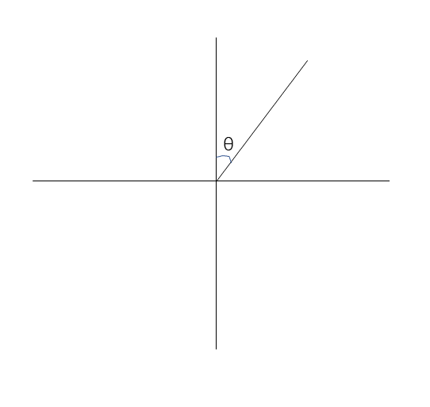
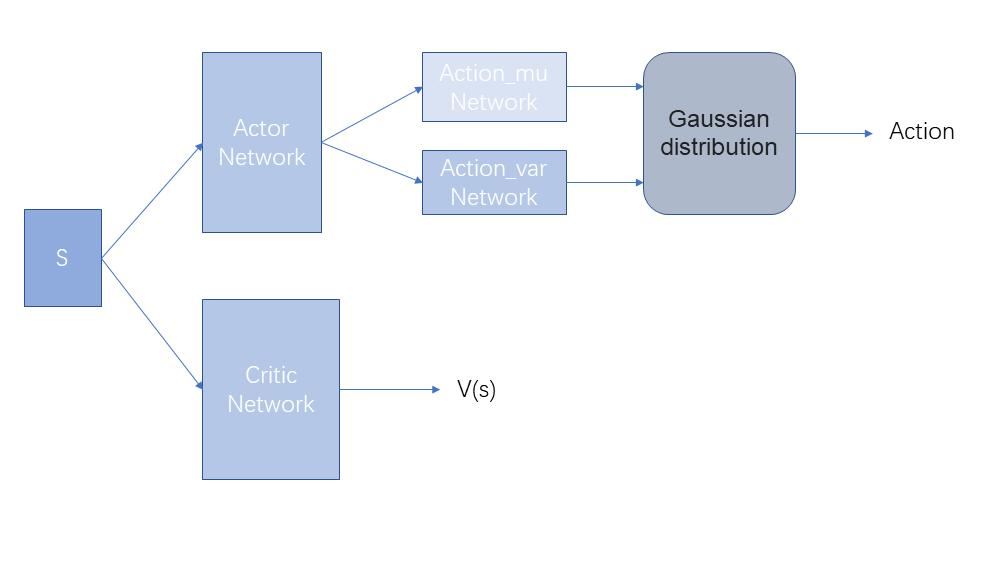
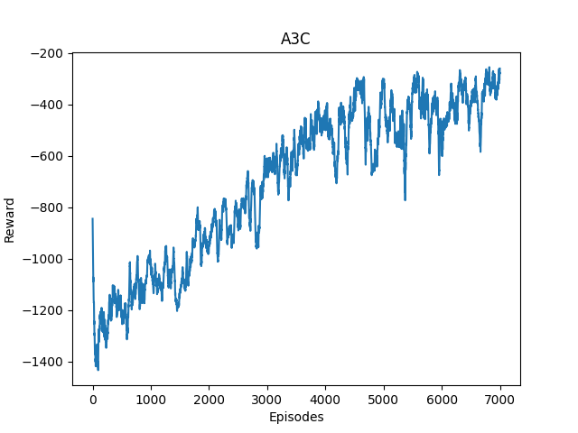
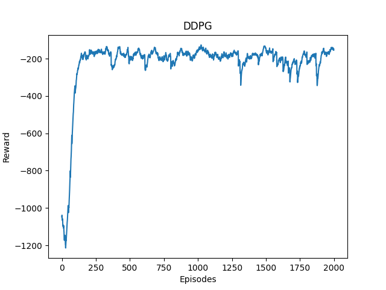
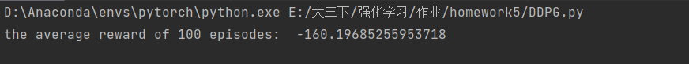

<center><font face="" size=40>Assignment 5</font></center>
<center><font face="" size=5>Peng Tang 517020910038</font></center>

In this assignment , we are going to implement A3C and DDPG algorithm and test them in a classical RL control environment-Pendulum.  

# Analysis

## Environment Explanation

In the Pendulum game, the goal is to apply torque on the free end to swing the pendulum in to an upright position, with its center of gravity right above the fixed point.

- Observation Space: the observation is a array containing three elements. 

| Num  | Observation        | Min  | Max  |
| ---- | ------------------ | ---- | ---- |
| 0    | x = $\cos(\theta)$ | -1.0 | 1.0  |
| 1    | y = $\sin(\theta)$ | -1.0 | 1.0  |
| 2    | Angular Velocity   | -8.0 | 8.0  |

The $\theta$ is shown as following angle.



- Starting State: The starting state is a random angle in $[-\pi, \pi]$ and a random angular velocity in $[-1,1]$.
- Action Space:  The action is an array containing one element, which represents the torque applied to free end of the pendulum. It is in $[-2,2]$
- Reward: reward is in $[ -16.2736044,0]$
- Terminal Conditions: The episode length is greater than $200$.

## A3C

This algorithm is a policy gradient  and on-policy method. In this algorithm, we run multiple asynchronous  actors-learners in parallel to speed up the training process. In specially, A3C model contains a global actor-critic network and multiple local actor-critic networks. These local actor-critic networks learn separately and share their learning results with each other through the global network. In this way, the whole model can learn more acknowledge about the environment. In the Pendulum environment, we can construct the actor-critic network as follow.

 

We construct Actor network to output action and Critic network to output values. Because the action space is continuous and we need to find the distribution of the action, we use the actor network to output the $\mu$, $\sigma$ of action, and then  choose an action from the gaussian distribution. With this network, we can implement the A3C as following steps:

- Construct a global actor-critic network $GN$ and global counter $T=0$ and multiple local actor-critic network $LN$s with the parameters of $GN$.

- for each local network $LN$, do following steps for an episode:

  - Initialize the environment by  using the  `gym` interface and get the initial observation $s$ and set a temp buffer $N$, the max step $S$ and a step counter $c=0$.

  - $c = c+1$

  - select an action $a$ by using the actor in $LN$ with $s$.

  - get the next observation $s'$ , reward $r$, and done $d$ from the environment by take $a$.

  - store the $(s,a,r,s', d)$ in the N.

  - if done or $c>S$:

    - compute the $R_t = \sum_{i=t}^c \gamma^{i-t}r_i$ for all $t$ by using $r$ in $N$ and store them  in $R$.

    - compute the gaussian distribution $GD$ of action and values $V$ of states by inputing $s$ in $LN$. 
    - compute the actor loss $AL = \log GD(a)(R-V)$ and critic loss $CL = (R-V)^2$.
    -  perform a gradient descent by using $AL$ and $CL$ and push the gradient to $GN$ and update the weights of $GN$. 
    - set the weights of $LN$ equal $GN$.
    - Go to the first step.

  - $s=s'$, go to the second step.

## DDPG

DDPG is a policy gradient method and it can be considered as a continuous action version of DQN. In DQN, we use the greedy algorithm to select the action for $s'$. While DDPG use a network to output the action for continuous  space. Especially, we use two actor-critic networks for DDPG, one is evaluation network and the  other is target network. We fix the target network and train the evaluation network and update the weights of target network with the weights of evaluation for fixed steps. This is same as DQN. Because there are two networks in actor-critic network, we need to train the two networks, namely the actor and the critic. We can  implement it as following steps:

- Initialize critic network $Q$ and actor network $A$. 
- Initialize target critic network $Q'$ with the weights of $Q$ and target actor network $A'$ with the weights of $A$.
- Initialize the replay buffer $N$.
- for each episode, we do following steps:
  - Initialize the environment by  using the  `gym` interface and get the initial observation $s$ and set the max step $S$ and a step counter $c=0$.
  - $c=c+1$
  - Select an action $a= A(s)$.
  - Get the next observation $s'$ , reward $r$, and done $d$ from the environment by taking $a$.
  - store $(s,a,r,s',d)$ in $N$.
  - if $N$ is full:
    - sample a Batch $B$ from $N$. 
    - compute evaluation values $q = Q(B(s),B(a))$
    - compute target values $q' = B(r) + \gamma * Q'(B(s'), A'(B(s')))$
    - compute the loss $CL = \frac{1}{|N|} \sum(q_i - q'_i)^2$ 
    - compute the actions $ a'= A(B(s)) $
    - compute the values $q''=Q(B(s),a')$
    - compute the loss $AL = -\sum(q''_i)/|q''|$
    - perform a gradient descent by using $AL$ and $CL$ and update the weights of $A$ and $Q$.
  - if $d$ is true or $c>S$, go the the first step
  - $s=s'$, go to the second step.
- Until reach the max episodes.

# Code

## A3C

### A3C Network

```python
class A3CNet(nn.Module):
    def __init__(self, s_dim, a_dim):
        super(A3CNet, self).__init__()
        self.s_dim = s_dim
        self.a_dim = a_dim

        self.actorNet = nn.Sequential(
            nn.Linear(s_dim, 256),
            nn.ReLU(),
            nn.Linear(256, 64),
            nn.ReLU(),

        )


        self.actor_mu = nn.Sequential(
            nn.Linear(64, a_dim),
            nn.Tanh()
        )
        self.actor_sigma = nn.Sequential(
            nn.Linear(64, a_dim),
            nn.Softplus()
        )


        self.criticNet = nn.RNN(
            input_size=3,
            hidden_size=128,  
            num_layers=1, 
            batch_first=True, 
        )
        self.out = nn.Linear(128, 1)


    def forward(self, input, h_state):

        a = self.actorNet(input)
        a_mu = 2 * self.actor_mu(a)
        a_sigma = self.actor_sigma(a) + 0.001

        input1 = input[None,:,:] 
        out, h_state = self.criticNet(input1, h_state)
        v = []
        for i in range(out.size(1)):
            v.append(self.out(out[:, i, :]))
        return a_mu, a_sigma, torch.stack(v,dim=1), h_state

    def choose_action(self, state, test = False):
        h_state = None
        action_mu, action_sigma, v, h_state = self.forward(torch.FloatTensor(np.array(state)).view(-1, self.s_dim),h_state)
        h_state = h_state.data
        if test:
            return action_mu.data.numpy()
        action = torch.normal(action_mu.view(1, ).data, action_sigma.view(1, ).data).numpy()
        return action

    def loss_func(self, s, a, R_t):
        h_state = None
        self.train()
        action_mu, action_sigma, values, h_state = self.forward(s,h_state)
        h_state = h_state.data
        values.view(-1,1)
        advantages = R_t - values
        critic_loss = advantages.pow(2)
        distributions = Normal(action_mu, action_sigma)  
        log_prob = distributions.log_prob(a) 
        entropy = 0.5 + 0.5 * math.log(2 * math.pi) + torch.log(distributions.scale)

        actor_loss = -(log_prob * (advantages.detach()) + 0.005 * entropy)  
        return (critic_loss + actor_loss).mean()
```

- This network contains two sub networks, actor network and critic network. For actor network, we break the final layer into two sections, one for $\mu$ and  the other for $\sigma$. For critic network, we use RNN to implement it because RNN has a better performance on this condition.
- The **choose_action()** is used to choose an action from the gaussion distribution that constructed by $\mu$ and $\sigma$.
- The **loss_func()** is used to compute the loss function. For convenience, we add actor loss and critic loss together. 

### Worker Model

```python
class worker(mp.Process):
    def __init__(self,  name,s_dim,a_dim, gamma ,share_optimizer, globalNet, globalmaxEpisodes, shareCurrentEpisode, shareQueue):
        super(worker, self).__init__()
        self.s_dim = s_dim
        self.a_dim = a_dim
        self.name = name
        self.globalNet = globalNet
        self.share_optimizer = share_optimizer
        self.localNet = A3CNet(self.s_dim,self.a_dim)

        self.globalmaxEpisodes = globalmaxEpisodes
        self.shareCurrentEpisode = shareCurrentEpisode
        self.shareQueue = shareQueue
        self.gamma = gamma

        self.env = gym.make('Pendulum-v1')


    def training(self, episode_s, episode_a, episode_r, final_s, done):

        h_state = None
        R_t = []
        s_val = 0
        if not done:
            action_mu, action_sigma, v, h_state =self.localNet(torch.from_numpy(np.array(final_s)).view(-1, 3), h_state)
            h_state = h_state.data

            s_val = v.data.numpy()[0][0][0]

        for r in episode_r[::-1]:
            s_val = r + self.gamma * s_val
            R_t.append(s_val)
        R_t.reverse()

        # 求loss
        loss = self.localNet.loss_func(torch.FloatTensor(np.array(episode_s)).view(-1, self.s_dim),
                                     torch.FloatTensor(np.array(episode_a)).view(-1, self.a_dim),
                                     torch.FloatTensor(np.array(R_t)).view(-1, 1))

        self.share_optimizer.zero_grad()
        loss.backward()
        for thispara1, globpara1 in zip(self.localNet.parameters(), self.globalNet.parameters()):
            globpara1._grad = thispara1.grad
        self.share_optimizer.step()
        self.localNet.load_state_dict(self.globalNet.state_dict())


    def run(self):

        myepisode = 0
        while self.shareCurrentEpisode.value < self.globalmaxEpisodes:

            states = []
            actions = []
            rewards = []
            state = self.env.reset()

            step = 0
            totalreward = 0
            while True:
                # self.env.render()
                step += 1
                action = self.localNet.choose_action(state)
                next_state, reward, done, _ = self.env.step(action.clip(-2, 2))
                states.append(state)
                actions.append(action)
                rewards.append((reward+8.0)/8.0)
                totalreward += reward
                if done or step >= 200:
                    self.training(states, actions, rewards, next_state, done)
                    break

                #elif step%10 == 0:
                    #self.training(states,actions,rewards,next_state,done)
                state = next_state

            print(self.name, " ", myepisode, " ", self.shareCurrentEpisode.value, " ", step, " ", totalreward)


            if (totalreward > 0):
                currentTime = time.strftime("%Y_%m_%d_%H_%M_%S", time.localtime())
                savepath1 = 'a3cparamaters/' + self.name + '_' + currentTime + "_" + str(self.shareCurrentEpisode.value) + "_" + str(
                    totalreward) + '.pkl'
                torch.save(self.localNet.state_dict(), savepath1)

            myepisode += 1
            with self.shareCurrentEpisode.get_lock():
                self.shareCurrentEpisode.value += 1
            self.shareQueue.put(totalreward)
        self.shareQueue.put(None)

```

- This class is  to train the network. We can define multiple objects based on this class. Then we can run them on multiple cores parallelly. 
- **globalNet** is the global network shared by all workers; **localNet** is the local network trained in the worker. **globalmaxEpisodes** is the number of total episodes we are going to experience. 
- The **train()** is used to train the local network, update the gradient to the global network, update the weights of global network and update the local network with the global network.
- The **run()** is used to perform the environment and get the training data, then call the **train()** to train the network.


### Main Function

```python
def main():
    env1 = gym.make('Pendulum-v1')
    StateDim = env1.observation_space.shape[0]
    ActionDim = env1.action_space.shape[0]
    globalNet = A3CNet(StateDim,ActionDim)
    globalNet.share_memory()
    share_optimizer = SharedAdam(globalNet.parameters(),lr=0.0001)
    MaxEpisodes = 7000
    shareCurrentEpisode = mp.Value('i', 0)
    shareQueue = mp.Queue()
    gamma = 0.9

    worker1 = worker("worker1",StateDim,ActionDim,gamma,share_optimizer,globalNet,MaxEpisodes,shareCurrentEpisode,shareQueue)
    worker2 = worker("worker2",StateDim,ActionDim,gamma,share_optimizer,globalNet,MaxEpisodes,shareCurrentEpisode,shareQueue)
    worker3 = worker("worker3",StateDim,ActionDim,gamma,share_optimizer,globalNet,MaxEpisodes,shareCurrentEpisode,shareQueue)
    worker4 = worker("worker4",StateDim,ActionDim,gamma,share_optimizer,globalNet,MaxEpisodes,shareCurrentEpisode,shareQueue)

    worker4.start()
    worker3.start()
    worker2.start()
    worker1.start()

    rewardlist = []
    while True:
        r = shareQueue.get()
        if r is not None:
            rewardlist.append(r)
        else:
            break
    worker4.join()
    worker3.join()
    worker2.join()
    worker1.join()

    re = 0
    rewardlist1 = []
    for item in rewardlist:
        if re == 0:
            re = item
        else:
            re = re*0.95+item*0.05
        rewardlist1.append(re)

    drawfig(rewardlist1)
```

The function is used to run four processes to train the global network.

## DDPG

### Actor-Critic Network

```python
class ActorNet(nn.Module):
    def __init__(self,s_dim, a_dim):
        super(ActorNet, self).__init__()
        self.actor = nn.Sequential(
            nn.Linear(s_dim, 128),
            nn.ReLU(),
            nn.Linear(128, 64),
            nn.ReLU(),
            nn.Linear(64, a_dim)
        )
        self.actor_mu = nn.Tanh()


    def forward(self, input):
        a = self.actor(input)
        a_mu = 2 * self.actor_mu(a) 
        return a_mu

class CriticNet(nn.Module):
    def __init__(self, s_dim):
        super(CriticNet, self).__init__()
        self.critic = nn.Sequential(
            nn.Linear(s_dim+1, 128),
            nn.ReLU(),
            nn.Linear(128, 64),
            nn.ReLU(),
            nn.Linear(64, 1)
        )
    def forward(self, input):
        return self.critic(input)
```

- The **ActorNet** is used to build $A$, which maps the state to the action. 
- The  **CriticNet** is used to build $Q$, which compute the q-value by inputing the $s,a$. 
- In this game, the output layer is one dim for both networks.

### DDPG Network

```python
class DDPGNet(object):
    def __init__(self, s_dim, a_dim):
        self.a_dim = a_dim
        self.s_dim = s_dim
        self.gamma = 0.9

        self.critic = CriticNet(s_dim)
        self.critic_target = CriticNet(s_dim)

        self.actor = ActorNet(s_dim,a_dim)
        self.actor_target = ActorNet(s_dim,a_dim)

        self.actor_optimizer = torch.optim.Adam(self.actor.parameters(), lr=0.001)
        self.critic_optimizer = torch.optim.Adam(self.critic.parameters(), lr=0.001)

        self.critic_target.load_state_dict(self.critic.state_dict())
        self.actor_target.load_state_dict(self.actor.state_dict())
        self.action_var = 0.5

        self.bathsize = 256
        self.BufferSize = 5000
        self.currentpointer = 0
        self.replayBuffer = np.zeros(self.BufferSize,dtype=object)

        self.loss_fun = torch.nn.MSELoss()


    def get_action(self, state, noise = False):

        action_mu = self.actor(torch.FloatTensor(np.array(state)).view(-1,self.s_dim))
        action = torch.normal(action_mu.view(1,).data, torch.from_numpy(np.array([self.action_var]))).numpy()

        if noise:
            return action_mu.view(1,).data.numpy()
        else:
            self.action_var= self.action_var*0.99
            return action

    def push_transition(self,trans):
        self.currentpointer = self.currentpointer % self.BufferSize
        self.replayBuffer[self.currentpointer] = trans
        self.currentpointer +=1

    def get_traindata(self):
        Batch = np.random.choice(self.replayBuffer,self.bathsize,replace=False)
        obsBatch = []
        actionBatch = []
        rewardBatch = []
        nextObsBatch = []
        doneBatch = []

        for i in range(self.bathsize):
            obsBatch.append(Batch[i][0])
            actionBatch.append(Batch[i][1])
            rewardBatch.append(Batch[i][2])
            nextObsBatch.append(Batch[i][3])
            doneBatch.append(Batch[i][4])

        obsBatch = np.array(obsBatch)
        actionBatch = np.array(actionBatch)
        rewardBatch = np.array(rewardBatch)
        nextObsBatch = np.array(nextObsBatch)
        doneBatch = np.array(doneBatch)

        return obsBatch, actionBatch, rewardBatch, nextObsBatch, doneBatch


    def train(self):
        obsBatch, actionBatch, rewardBatch, nextObsBatch, doneBatch = self.get_traindata()
        obsBatch = torch.FloatTensor(obsBatch).view(-1,self.s_dim)
        actionBatch = torch.FloatTensor(actionBatch).view(-1,1)
        rewardBatch = torch.FloatTensor(rewardBatch).view(-1,1)
        nextObsBatch = torch.FloatTensor(nextObsBatch).view(-1,self.s_dim)
        doneBatch = torch.from_numpy(doneBatch).view(-1, 1)

    
        q_eval = self.critic(torch.cat((obsBatch,actionBatch),1))
        nextActionBatch = self.actor_target(nextObsBatch)
        q_next = self.critic_target(torch.cat((nextObsBatch, nextActionBatch),1)).detach()
        q_target = rewardBatch+(torch.logical_not(doneBatch))*self.gamma*q_next
        loss = self.loss_fun(q_eval,q_target)
        self.critic_optimizer.zero_grad()
        loss.backward()
        self.critic_optimizer.step()

        actionpre = self.actor(obsBatch)
  
        q_pre = self.critic(torch.cat((obsBatch, actionpre), 1))
        loss1 = -q_pre.mean()
        self.actor_optimizer.zero_grad()
        loss1.backward()
        self.actor_optimizer.step()

        for target_critic_param, critic_param in zip(self.critic_target.parameters(), self.critic.parameters()):
            target_critic_param.data.copy_(target_critic_param.data*0.9 + critic_param.data*0.1)

        for target_actor_param, actor_param in zip(self.actor_target.parameters(), self.actor.parameters()):
            target_actor_param.data.copy_(target_actor_param.data*0.9+actor_param.data*0.1)

```

- In this class, we build two critic networks(**critic** and **critic_target**) and two actor networks(**actor** and **actor_target**). And we use the **replayBuffer** to store the transitions. The **actor_optimizer** is for **actor** and the **critic_optimizer** is for **critic**. The **loss_fun** is for **critic**. 
- The **get_action()** is used to choose a action. In order to  implement exploration, we use the gaussion distribution to choose a action. And as processing, we will decrease the var of the distribution, then we can use the output of $A$ more. 
- The **push_transition()** is used to store a transition in the replay memory.
- The **get_traindate()** is used to randomly sample a batch from the replay memory.  

-  The **train()** is used to train the **critic** and **actor** according to the analysis. 

### Running function

```python
def running():
    env = gym.make('Pendulum-v1')
    StateDim = env.observation_space.shape[0]
    ActionDim = env.action_space.shape[0]
    maxEpisodes = 2000
    maxstep = 400
    DDPG = DDPGNet(StateDim, ActionDim)
    totalstep = 0
    rewardlist = []

    for episode in range(maxEpisodes):
        obs = env.reset()
        totalreward = 0
        step = 0
        while True:
            #env.render()
            totalstep +=1
            step += 1
            action = DDPG.get_action(obs)
            nextobs, reward, done, _ = env.step(action)
            totalreward += reward
            transtion = (obs,action,reward,nextobs,done)
            DDPG.push_transition(transtion)

            if totalstep>DDPG.BufferSize+1:
                DDPG.train()

            if done or step>maxstep:

                print(episode, " ", totalreward)

                if(totalreward>-125):
                    currentTime = time.strftime("%Y_%m_%d_%H_%M_%S", time.localtime())
                    savepath1 = 'ddpgparamaters/' + "actor" + '_' + currentTime + "_" + str(episode) +"_"+ str(
                        totalreward) + '.pkl'
                    savepath2 = 'ddpgparamaters/' + "critic" + '_' + currentTime + "_" + str(episode) + "_" + str(
                        totalreward) + '.pkl'
                    torch.save(DDPG.actor.state_dict(), savepath1)
                    torch.save(DDPG.critic.state_dict(),savepath2)


                break
            obs = nextobs
        rewardlist.append(totalreward)

    drawfig(rewardlist)
```

We use this function to perform the environment and get the training data to train network according to given parameters. 


# Experiment Results

## A3C

By running the *A3C.py*, we got the following result.



From the figure, we can see that we need $5000$ episodes to reach a relatively good performance. 

We tested the trained network for 100 episodes and got the following result. 


## DDPG

By running the *DDPG.py*, we got the following result.



From the figure, we can see that, after about $250$ episodes, we can  get a good performance. Thus, We don't need to train it too much times in the DDPG. 

We tested the trained network for 100 episodes and got the following result. 




## Compare

- From above results, we can see that the DDPG has a better performance than A3C in this environment. This is because DDPG is more suitable for continuous space problem, while A3C is more suitable for discrete space problem.
- What's more, A3C needs more episodes to train the network. But A3C runs faster than DDPG for the same number of episodes. 


